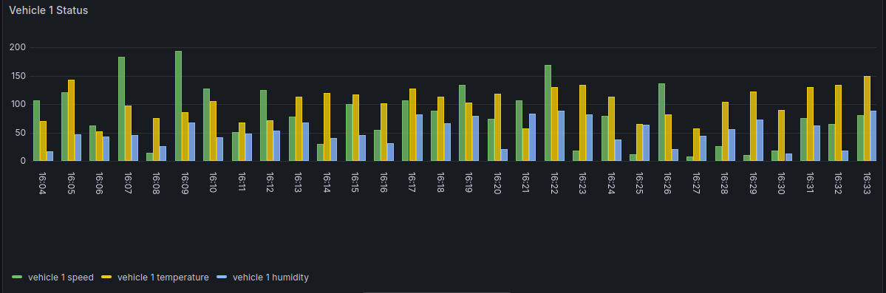
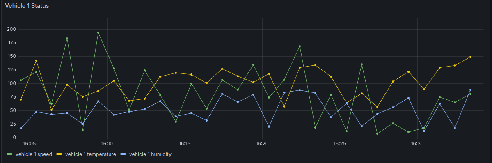
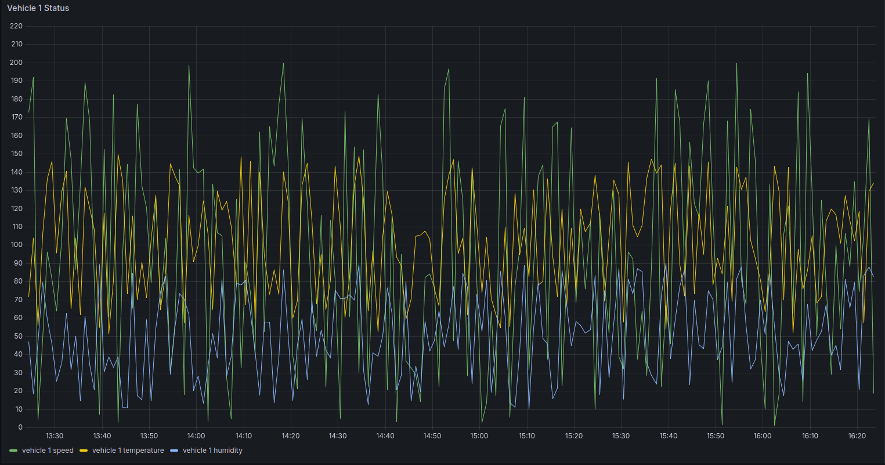
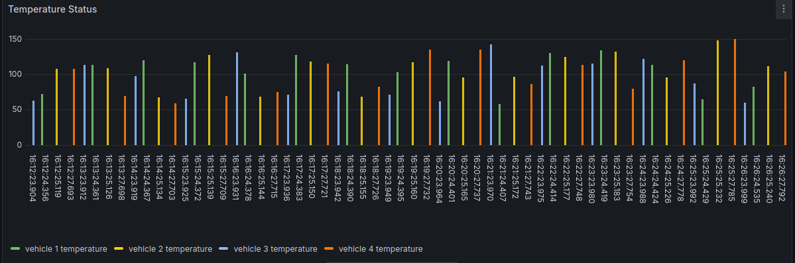
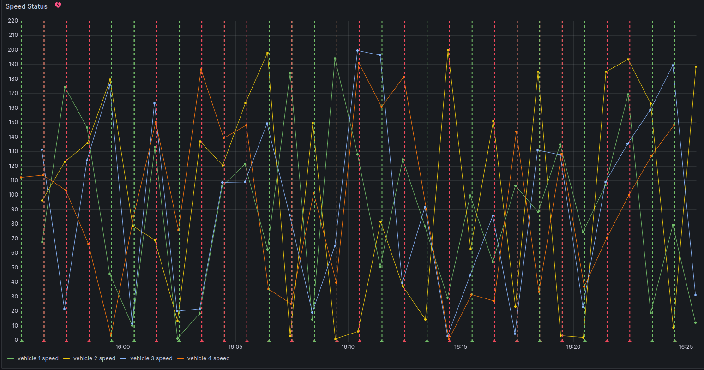
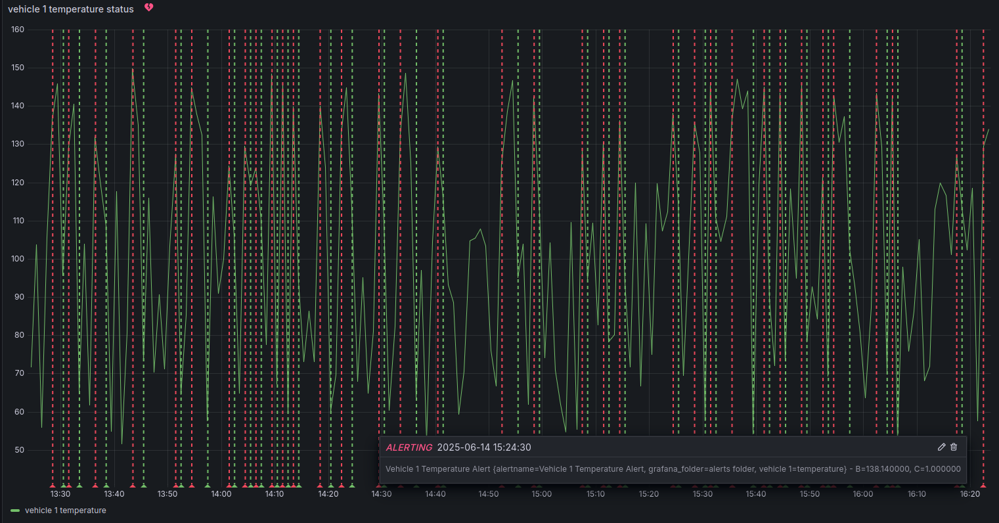
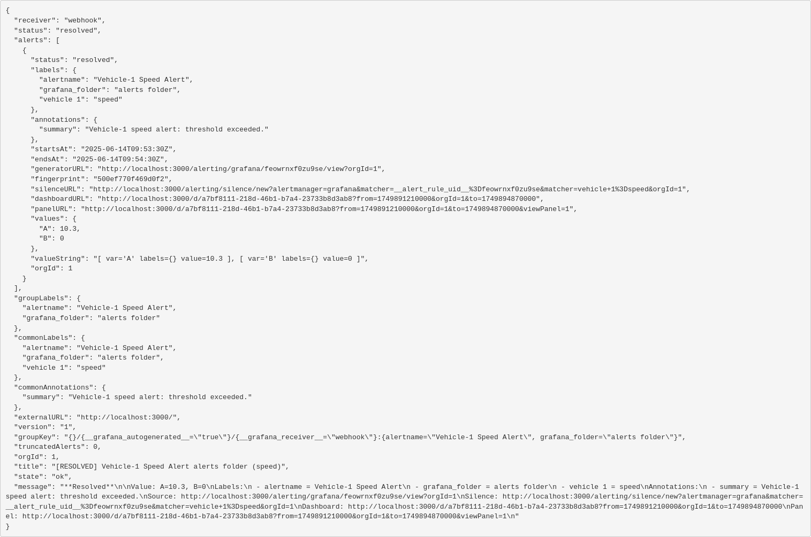

# Real-Time Vehicle Telemetry Monitoring System
## 📘 Overview
This project implements a real-time vehicle telemetry monitoring system that ingests, stores, visualizes, and monitors data streams from multiple simulated vehicles. It is built using Apache Kafka, TimescaleDB, and Grafana, all orchestrated through Docker. The goal is to simulate real-world IoT telemetry workflows with observability, alerting, and scalability in mind.

## 🎯 Motivation
In a world of connected vehicles and intelligent transportation systems, real-time telemetry is critical for performance monitoring, predictive maintenance, and safety analysis. This project explores how modern data pipelines and observability stacks can be leveraged to handle high-throughput vehicle data reliably and efficiently.

## ⚙️ Getting Started

This project is fully containerized and requires only Docker for setup and execution.

### ✅ Requirements
- **Docker** (with Docker Compose support)  
  [→ Install Docker](https://docs.docker.com/get-docker/)

> All components—Kafka, TimescaleDB, Grafana, and Python services—are managed using Docker Compose. No manual installation of individual dependencies is necessary.

---

### 🚀 Running the System

```bash
# Clone the repository
git clone https://github.com/your-username/vehicle-telemetry-monitoring.git
cd vehicle-telemetry-monitoring

# Build and launch all services
docker-compose up --build
```
Once initialized:
- Kafka producers begin simulating and publishing vehicle telemetry data.
- The consumer ingests this data and stores it in TimescaleDB.
- Grafana becomes accessible at http://localhost:3000
> Note: The initial startup may take 1–2 minutes while services pass their health checks and dependencies initialize.

---

### 🧹 Stopping and Cleanup

To stop all running services:
```bash
docker-compose down
```
To remove all associated containers, networks, and volumes (including TimescaleDB data and Grafana state):
```bash
docker-compose down -v
```

## 🖥️ System Architecture
The system consists of five major components:
1. **Kafka Producers** – Simulate telemetry data for each vehicle.
2. **Kafka Consumer** – Processes and forwards incoming data to TimescaleDB.
3. **TimescaleDB** – A time-series optimized PostgreSQL database.
4. **Grafana** – Visualizes metrics and raises alerts on abnormal patterns.
5. **Docker** – Handles the orchestration of all services.

## 🔄 Data Flow Summary
Vehicle Simulation (Producer) --> Kafka Topic --> Kafka Consumer --> TimescaleDB --> Grafana

## 🛠️ Implementation Journey
### 🚗 Simulating Vehicles with Kafka Producers
The journey began with the design of a Kafka-based producer-consumer pipeline tailored to vehicle telemetry. Each producer simulates a vehicle sending real-time data including:
- `vehicle_id`: Unique identifier for the vehicle
- `latitude`, `longitude`: GPS coordinates for real-time location tracking
- `speed`: Vehicle’s current speed in km/h
- `temperature`, `humidity`: Engine metrics
- `timestamp`: UTC timestamp of data generation

Kafka producers were containerized using Docker, with four separate containers representing individual vehicles. These containers emit telemetry data into a Kafka topic, forming the first stage of the data pipeline.

---

### 📥 Real-Time Ingestion – Kafka Consumer
A Python-based Kafka consumer subscribes to the same topic and continuously listens for incoming messages. Each message is parsed and inserted into a TimescaleDB table. This table is schema-optimized for time-series operations, allowing for efficient storage and querying.

---

### 💾 Persistent Time-Series Storage – TimescaleDB
TimescaleDB serves as the system’s primary datastore. As a PostgreSQL extension optimized for time-series workloads, it efficiently handles large volumes of time-stamped vehicle telemetry data. The schema is designed to support historical analysis, real-time dashboards, and condition-based alerts.

---

### 📈 Observability and Monitoring – Grafana Integration
To provide real-time observability, Grafana is integrated directly into the Docker stack:
- Data Source: TimescaleDB is configured as a data source in Grafana.
- Dashboards: Custom dashboards visualize key metrics such as vehicle speed, temperature trends, humidity levels, and location traces over time.
- Alerting: Grafana alerts are configured for threshold conditions (e.g., speed > 120 km/h, temperature > 80°C). These alerts are delivered through a webhook contact point that notifies a local HTTP endpoint.


*Figure: Grafana bar chart dashboard visualizing telemetry from Vehicle 1 — speed (green), temperature (yellow), and humidity (blue) — over time.*


*Figure: Grafana time series dashboard visualizing telemetry from Vehicle 1 — speed (green), temperature (yellow), and humidity (blue) — over time.*


*Figure: Grafana dashboard for Vehicle 1 displaying key telemetry metrics — speed (green), temperature (yellow), and humidity (blue) — over time.*


*Figure: Comparative temperature trends of four vehicles displayed on a single Grafana time-series plot.*

---

### 🚨 Alerting via Webhook
Grafana allows the creation of alert rules that continuously evaluate query results against predefined thresholds. When a metric breaches a threshold condition, Grafana triggers an alert. Grafana supports webhook contact points — HTTP endpoints that receive alert notifications as JSON payloads via POST requests.


*Figure: Speed alerts for all vehicles, highlighting instances where speed thresholds were exceeded.*


*Figure: Multiple temperature alerts from Vehicle 1 displayed over time; the highlighted alert triggered on 2025-06-14 at 15:24:30 indicates an abnormal event.*


*Figure: Webhook payload displaying alert notification details sent from Grafana upon threshold breach.*

---

### 🌿 Isolated Development with Git Branching
To ensure clean and modular development, the integration with TimescaleDB was carried out in a dedicated Git branch: timescaleDB-integration. This isolated environment allowed for iterative testing and adjustments without disrupting the main codebase.

Once the integration was stable and fully tested — including schema validation, ingestion reliability, and query performance — the branch was merged back into main, establishing a solid, version-controlled foundation for the end-to-end telemetry pipeline.

---

### 🐳 Orchestration with Docker
All services — Kafka, Zookeeper, TimescaleDB, Grafana, producer(s), and consumer — are defined and orchestrated in a single docker-compose.yaml file. A key challenge in orchestrating interdependent services is ensuring correct startup order. To address this, a series of Docker health checks and service dependencies were implemented, allowing containers to wait for their critical dependencies before becoming active.
- **Zookeeper** acts as the foundational coordination service for Kafka. It exposes a health check that verifies responsiveness by sending a `ruok` command and expecting an `imok` response. Kafka explicitly depends on Zookeeper and waits until Zookeeper is healthy before starting.
- **Kafka** depends on Zookeeper and performs its own health check by attempting to list Kafka topics. This ensures Kafka is fully operational and ready to accept connections before producers and consumers start.
- The **producer containers** simulate vehicle telemetry data and depend on Kafka's health status. Each producer waits until Kafka is healthy before publishing messages.
- The **consumer container**, which subscribes to Kafka topics and inserts data into TimescaleDB, waits on **both Kafka and TimescaleDB** services. TimescaleDB exposes a health check using `pg_isready` to confirm the database is ready to accept connections before the consumer starts processing data.
- **Grafana** depends on TimescaleDB being healthy before launching, ensuring data sources and dashboards load correctly.

---

## ⚠️ Challenges Encountered
| Issue               | Description                                        | Resolution                                     |
|---------------------|--------------------------------------------------|-----------------------------------------------|
| Docker on Windows   | Services failed to start reliably after reboots  | Switched to Linux environment for stable container support |
| TimescaleDB startup delays | Consumers would crash on startup if DB wasn't ready | Added health checks and auto-retry with `restart: always` |
| Docker signal handling | Cleanup logic didn’t execute during shutdown    | Currently under investigation                  |

## 🔮 Further Improvements and Future Directions
- Migrate storage to Apache Cassandra for scalable, distributed time-series data handling, and adopt Prometheus for comprehensive monitoring, alerting, and performance metrics.
- Apply AI/ML techniques to analyze telemetry data for predictive maintenance, anomaly detection, and driver behavior analysis.
- Integrate real-time GPS/GPRS data from actual vehicles to replace simulated data streams.
- Enhance geospatial capabilities with map integration and route optimization for better location analytics.
- Implement edge device communication for secure, reliable telemetry transmission over cellular networks.
- Expand telemetry data to include fuel levels, consumption rates, engine diagnostics, tire pressure, battery status, and other sensor metrics.
- Implement end-to-end encryption and robust authentication/authorization mechanisms to secure data transmission and access.

## 📝 Closing Thoughts
This project demonstrates how a robust end-to-end telemetry pipeline can be built using open-source technologies to process, store, and visualize real-time IoT-style data. Through containerized orchestration, scalable data ingestion, and time-series analysis, it lays a strong foundation for building intelligent, data-driven systems.

By simulating multi-vehicle data, integrating persistent storage, and enabling real-time monitoring through Grafana, the system reflects the architectural principles needed for real-world telemetry platforms. It is modular, extensible, and production-aware — making it well-suited for scaling to real-time analytics, advanced alerting, and AI-driven insights.

As the system evolves with real-world data, machine learning, and infrastructure optimizations (e.g., Cassandra and Prometheus), it will continue to mature toward a fully intelligent and autonomous telemetry solution.
