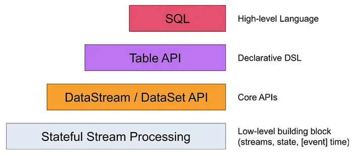

# 🚘 Real-Time Vehicle Telemetry Monitoring System – Apache Flink Integration

## 📘 Overview
This branch implements a **streaming data pipeline** using **Kafka and Apache Flink**, orchestrated through **Docker**, where Flink acts as a real-time consumer for vehicle telemetry data. It replaces the earlier Python-based Kafka consumer to enable more scalable and fault-tolerant stream processing.

> This version focuses purely on data ingestion and stream processing, without database storage or dashboarding. These parts can be integrated later if needed.

## 🧠 About Apache Flink
Apache Flink is an open-source, distributed computing system that can process large amounts of data in real time. It’s a powerful tool for data processing, stream processing, and complex event processing. The basic building blocks of Flink’s architecture are called **data streams**, which are streams of data that can be processed in parallel across a cluster of machines.

The Flink runtime consists of two types of processes: a **JobManager** and **one or more TaskManagers**.
- The JobManager has a number of responsibilities related to coordinating the distributed execution of Flink Applications: it decides when to **schedule the next task (or set of tasks), reacts to finished tasks or execution failures, coordinates checkpoints, and coordinates recovery on failures, among others**.
- The TaskManagers (also called workers) **execute the tasks of a dataflow, and buffer and exchange the data streams**. There must always be at least one TaskManager. The smallest unit of resource scheduling in a TaskManager is a **task slot**. The number of task slots in a TaskManager indicates the number of concurrent processing tasks. 

Flink has a rich set of APIs using which developers can perform transformations on both **batch and real-time data**. A variety of transformations includes **mapping, filtering, sorting, joining, grouping and aggregating**. These transformations by Apache Flink are performed on **distributed data**.

*Figure: Apache Flink abstraction layers, from low-level Stateful Stream Processing to high-level Flink SQL, showing increasing ease of use and abstraction.*
- At the lowest level is the **Stateful Stream Processing**, which is part of the DataStream API. These are primitive building blocks capable of implementing almost any operation by directly manipulating Flink's state backends and timer services. At this level, code is written that reacts to each event as it arrives, one at a time.
- The **DataStream API**, while including Stateful Stream Processing, generally operates at a slightly higher level of abstraction. It provides building blocks like streams and windows, offering more structured ways to process data.
- The **Table API** sits at an even higher level of abstraction. In terms of the abstractions involved, it is roughly equivalent to Flink SQL; however, instead of writing SQL queries, data processing logic is expressed using Java or Python code.
- At the highest level is **Flink SQL**, which provides a fully declarative interface for data processing using SQL syntax.

## 🎯 Why Use Apache Flink Instead of a Kafka Consumer?

The previous architecture used a basic Kafka consumer (in Python) to read and process messages. However, this approach had limitations:

| Limitation                      | Reason to Use Flink Instead                                    |
|----------------------------------|---------------------------------------------------------------|
| Limited Scalability              | Flink handles large-scale streams with built-in parallelism   |
| No Built-in Fault Tolerance      | Flink supports checkpointing and state recovery               |
| Lacks Event-Time Processing      | Flink provides out-of-the-box support for event-time windows  |
| Difficult to Manage in Production| Flink is designed for production-grade, real-time systems      |

Apache Flink offers a better alternative for production-grade stream processing with long-term scalability and reliability.

## ⚙️ Getting Started

This project is fully containerized and requires only Docker for setup and execution.

### ✅ Requirements
- *Docker* (with Docker Compose support)  
  [→ Install Docker](https://docs.docker.com/get-docker/)

> All components—Kafka, Zookeeper, and Apache Flink (JobManager and TaskManager)—are managed using Docker Compose. No manual installation of individual dependencies is necessary.

---

### 🚀 Running the System

```
# Clone the repository
git clone --single-branch --branch data-stream-flink https://github.com/KDitsa/Real-Time-Vehicle-Monitor.git
cd Real-Time-Vehicle-Monitor

# Build and launch all services
docker-compose up --build
```

Once initialized:
- Apache Flink connects to the Kafka topic `vehicle_data`.
- It consumes incoming JSON messages, parses them into structured fields (vehicle ID, location, speed, temperature, etc.).
- Flink prints each parsed record to the console using `print()` to verify successful ingestion and transformation.

> Note: The initial startup may take 1–2 minutes as Kafka, Zookeeper, and Flink services complete their health checks. Flink will only start processing once Kafka is fully ready and the required JAR files are loaded.

---

### 🧹 Stopping and Cleanup

To stop all running services:

```
docker-compose down
```

To remove all associated containers, networks, and volumes:

```
docker-compose down -v
```

## ⚙️ Technologies Used

| Tool              | Role                                                                                          |
|-------------------|-----------------------------------------------------------------------------------------------|
| **Kafka (Wurstmeister)** | Message broker for ingesting real-time telemetry data                                        |
| **Apache Flink**   | Stream processor that consumes data from Kafka using PyFlink                                 |
| **Zookeeper**      | Coordination service required by Kafka to manage brokers                                     |
| **Docker Compose** | Orchestrates all services including Kafka, Zookeeper, and Flink                              |
| **Python**         | Used to write Kafka producer scripts and the Flink streaming job using Table and DataStream APIs |

## 🛠️ Implementation Journey

### 🧱 1. Environment Setup with Docker Compose

The entire system is orchestrated using `docker-compose.yaml`, which includes the following services:

- **Zookeeper**: Ensures Kafka cluster coordination; includes a health check using `ruok/imok` pattern.
- **Kafka**: Uses Wurstmeister's image; configured with both internal (container-to-container) and external (host-accessible) listeners. Health is checked by listing topics.
- **Producer**: A Python container that publishes simulated vehicle telemetry data to Kafka. It starts only after Kafka is healthy and runs with four replicas.
- **Flink JobManager**: The central brain of the Flink cluster, it launches and manages the PyFlink job after the cluster is up.
- **Flink TaskManager**: Executes job tasks in parallel, using four task slots. It depends on the JobManager and is restarted automatically on failure.

All services are linked via a Docker network, and environment variables are used to pass configuration such as Kafka broker address and Flink properties. This setup allows seamless local deployment of a real-time stream processing pipeline with proper fault tolerance and restart logic.

---

### 🚗 Simulating Vehicles with Kafka Producers
The journey began with the design of a Kafka-based producer where each producer simulates a vehicle sending real-time data including:
- `vehicle_id`: Unique identifier for the vehicle
- `latitude`, `longitude`: GPS coordinates for real-time location tracking
- `speed`: Vehicle’s current speed in km/h
- `temperature`, `humidity`: Engine metrics
- `timestamp`: UTC timestamp of data generation

Kafka producers were containerized using Docker, with four separate containers representing individual vehicles. These containers emit telemetry data into a Kafka topic, forming the first stage of the data pipeline.

---

### 🧪 3. PyFlink Streaming Job Implementation

The Flink job is written in **PyFlink** (Python API for Flink) and does the following:

- Initializes the streaming execution environment (`StreamExecutionEnvironment`) and table environment (`StreamTableEnvironment`)
- Loads the **Kafka SQL connector JAR** into Flink via:

  ```python
  env.add_jars("file:///opt/flink/lib/flink-sql-connector-kafka-3.2.0-1.19.jar")
  ```
This JAR is downloaded and added during the Flink job container build process using the Dockerfile. The Dockerfile uses `wget` to fetch the connector JAR from Maven Central and places it into the Flink library directory (`/opt/flink/lib`), ensuring the connector is available when the job runs.
- Defines a **Flink SQL table** using the Kafka connector with schema matching the incoming JSON
- Queries this table with:

  ```sql
  SELECT * FROM kafka_source
  ```
- Converts the result table into a **DataStream** using `to_append_stream(...)` and prints each record

This job runs inside a Docker container and starts automatically when the cluster is up — making this an **Application Cluster** deployment.

---

### 🌿 4. Isolated Development with Git Branching
To ensure clean and modular development, the integration with Apache Flink was carried out in a dedicated Git branch: `data-stream-flink`. This isolated environment allowed for iterative testing and adjustments without disrupting the main codebase.

---

## ⚠️ Challenges Encountered and Solutions

| Challenge                            | Description                                                          | Solution                                                                                  |
|------------------------------------|----------------------------------------------------------------------|-------------------------------------------------------------------------------------------|
| Missing Kafka Connector JARs        | Flink jobs failed due to missing Kafka connector JAR                 | Added the required Kafka connector JAR (`flink-sql-connector-kafka`) to `/opt/flink/lib` via the Flink Dockerfile. |
| Python Dependency Issues             | PyFlink code requires compatible Python environment and dependencies | Installed necessary Python packages inside the Flink job container via Dockerfile to ensure environment consistency. |
| Kafka and Zookeeper Startup Order   | Flink consumer failed if Kafka or Zookeeper not ready                | Added Docker health checks and service dependencies to ensure Kafka and Zookeeper are healthy before Flink starts. |
| Flink Job Submission Timing          | Flink jobmanager started before dependencies were ready, causing job failures | Used delayed startup commands (`sleep`) and service dependencies to coordinate job submission timing. |
| Docker Resource Constraints          | Flink taskmanager requires sufficient CPU and memory for stable execution | Configured appropriate CPU and memory limits in docker-compose to prevent crashes and restarts. |

## 🔮 Future Enhancements

The current implementation provides a lightweight, modular base for real-time stream processing using Kafka and Apache Flink. The system can be extended with the following enhancements to make it more robust, intelligent, and production-ready:

- **Windowed Aggregations and Event-Time Processing:** Use Flink's time-based operators to calculate moving averages, detect outliers, or trigger alerts based on historical patterns.
- **Persistent Storage Integration:** Add TimescaleDB, PostgreSQL, or Apache Cassandra to store telemetry data for long-term retention and analysis.
- **Grafana Dashboards:** Integrate Grafana to visualize trends (speed, temperature, etc.) and configure alert rules for threshold breaches.
- **Real-Time Data from Physical Vehicles:** Replace simulated data with actual GPS/GPRS telemetry collected from connected vehicle hardware or APIs.
- **Geospatial Analytics and Mapping:** Implement route tracking, heatmaps, and regional insights by overlaying telemetry on maps.
- **Edge Device Integration:** Enable telemetry ingestion from IoT-enabled vehicle devices using MQTT, HTTPS, or cellular networks for real-time connectivity.
- **Expanded Telemetry Metrics:** Include additional signals like fuel levels, tire pressure, engine diagnostics, and battery health for comprehensive monitoring.
- **AI/ML-Based Intelligence:** Apply machine learning models for predictive maintenance, driving behavior scoring, or anomaly detection in vehicle telemetry.
- **Security Enhancements:** Add end-to-end encryption (TLS), secure authentication, and fine-grained access control to protect data in transit and at rest.

## 📝 Closing Thoughts

This branch explores the integration of Apache Flink as a real-time stream processor to replace traditional Kafka consumers. By leveraging PyFlink with both Table and DataStream APIs, the system efficiently ingests and processes vehicle telemetry data from Kafka, demonstrating Flink’s capabilities for high-throughput and low-latency stream processing.

While persistent storage and visualization components (such as TimescaleDB and Grafana) are not part of this branch’s scope, they can be added in subsequent iterations. The containerized architecture with Docker Compose allows easy extension and reproducibility, making it ideal for development and testing environments.

Overall, this work highlights the transition from basic Kafka consumer logic to a more scalable and production-oriented Flink-based architecture — ready to grow into a complete telemetry analytics pipeline.
