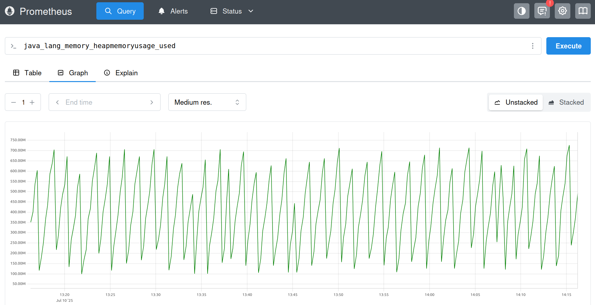
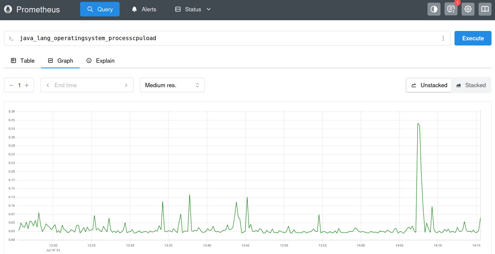
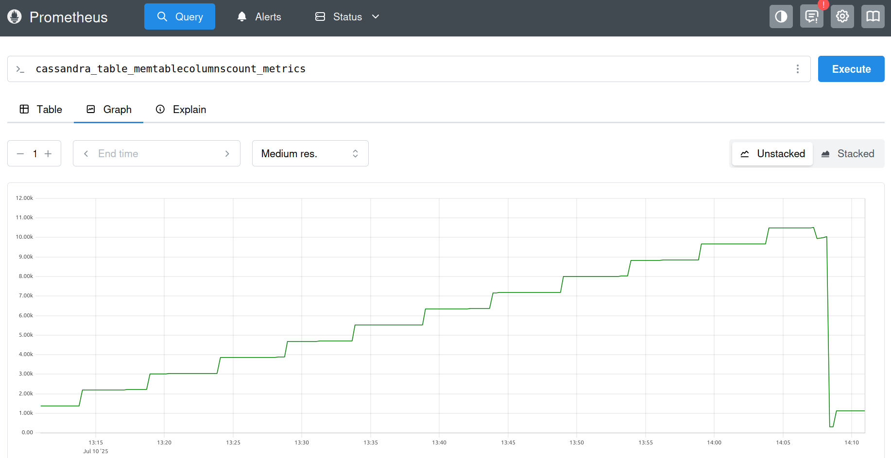

# 🚘 Real-Time Vehicle Telemetry Monitoring System – Cassandra Migration Edition
## 📘 Overview
This branch of the project focuses on migrating the vehicle telemetry storage backend **from TimescaleDB** (a time-series relational database) **to Apache Cassandra**, a distributed NoSQL database optimized for high-write throughput and horizontal scalability. The system continues to simulate real-time telemetry data from multiple vehicles using Kafka, and ingests that data for long-term storage and analysis.

## 🎯 Motivation: Why Switch to Apache Cassandra?
The original implementation used **TimescaleDB** for time-series data storage. While TimescaleDB offers SQL familiarity and PostgreSQL integration, it revealed limitations when scaled under high-ingest workloads. Apache Cassandra addresses these challenges with a distributed, write-optimized design.

| **Aspect**              | **TimescaleDB Limitation**                                              | **Cassandra Advantage**                                                   |
|-------------------------|--------------------------------------------------------------------------|---------------------------------------------------------------------------|
| **Scalability**         | Difficult to scale horizontally without complex setup                   | Linear horizontal scalability across commodity hardware                   |
| **Write Performance**   | Slower under high-ingest workloads without tuning                       | Designed for high-throughput writes with minimal tuning                   |
| **Availability**        | Can have single points of failure without HA configuration              | Peer-to-peer architecture with no single point of failure                 |
| **Schema Flexibility**  | Relational model can become restrictive as data evolves                 | Flexible NoSQL schema suits changing telemetry formats                    |
| **Fault Tolerance**     | Requires external tools for replication and failover                    | Built-in replication and automatic failover                              |
| **Operational Overhead**| Complex configuration for HA, clustering, and backups                   | Simpler scaling and management in distributed environments                |

> 🚀 Apache Cassandra provides a more robust foundation for real-time vehicle telemetry systems that demand high availability, performance, and scale.

## ⚙️ Getting Started

This project is fully containerized and requires only Docker for setup and execution.

### ✅ Requirements
- **Docker** (with Docker Compose support)  
  [→ Install Docker](https://docs.docker.com/get-docker/)

> All components — Kafka, Cassandra, Prometheus, and Python/Java services—are managed using Docker Compose. No manual installation of individual dependencies is necessary.

---

### 🚀 Running the System

```bash
# Clone the repository
git clone --single-branch --branch cassandra-migration https://github.com/KDitsa/Real-Time_Vehicle-Monitor.git
cd Real-Time_Vehicle-Monitor

# Build and launch all services
docker-compose up --build
```
Once the system is initialized:
- Kafka producers start simulating and publishing real-time vehicle telemetry data to a Kafka topic.
- The Kafka consumer subscribes to the topic, processes the incoming data, and stores it in Apache Cassandra.
- Prometheus begins scraping system and JVM-level metrics from the configured exporters and Java applications using the Prometheus Java Agent.

> ⏳ Note: The initial startup may take 1–2 minutes while services pass their health checks and dependencies initialize.

---

### 🧹 Stopping and Cleanup

To stop all running services:
```bash
docker-compose down
```
To remove all associated containers, networks, and volumes:

```bash
docker-compose down -v
```

## 🖥️ System Architecture
The system consists of five major components:
1. **Kafka Producers** – Simulate vehicle telemetry data.
2. **Kafka Consumer** – Processes and forwards incoming data to Apache Cassandra.
3. **Apache Cassandra** – Distributed, scalable NoSQL database for time-series-style telemetry data.
4. **Prometheus Exporter (Java Agent)** – A JMX-based exporter installed on Cassandra to expose JVM metrics such as heap memory usage, process cpu load, complete tasks, live data size and so on.
5. **Prometheus** – Scrapes system metrics and visualizes performance.
6. **Docker** – Handles the orchestration of all services.

## 🔄 Data Flow Summary
Vehicle Simulation (Producer) --> Kafka Topic --> Kafka Consumer --> Cassandra --> JMX Exporter --> Prometheus 

## 🛠️ Implementation Journey
### 🚗 Simulating Vehicles with Kafka Producers
The journey began with the design of a Kafka-based producer-consumer pipeline tailored to vehicle telemetry. Each producer simulates a vehicle sending real-time data including:
- `vehicle_id`: Unique identifier for the vehicle
- `latitude`, `longitude`: GPS coordinates for real-time location tracking
- `speed`: Vehicle’s current speed in km/h
- `temperature`, `humidity`: Engine metrics
- `timestamp`: UTC timestamp of data generation

Kafka producers were containerized using Docker, with four separate containers representing individual vehicles. These containers emit telemetry data into a Kafka topic, forming the first stage of the data pipeline.

---

### 📥 Real-Time Ingestion – Kafka Consumer
A Python-based Kafka consumer subscribes to the same topic and continuously listens for incoming messages. On message receipt, it:
- Parses each JSON message
- Writes data into Apache Cassandra
- Uses a time- and vehicle-centric schema optimized for queries by `vehicle_id` and `timestamp`

---

### 💾 Storage with Apache Cassandra
Apache Cassandra provides:

- A flexible schema to store time-series vehicle data efficiently
- Linear scalability for write-heavy telemetry workloads
-  High availability with no single point of failure

The schema is initialized using a `cassandra-init` service that runs `init.cql`.

---

### 📈 Metrics Scraping with Prometheus and Java Agent
Prometheus is configured to:
- Scrape JVM-level metrics (e.g. heap memory usage, garbage collection, thread activity) from Apache Cassandra using the Prometheus JMX Java Agent.
- Monitor the health and performance of core infrastructure components like Cassandra.

The Prometheus Java Agent is installed during the Docker image build process using `wget` to download the agent and maven to manage dependencies. It exposes application metrics at the `/metrics` endpoint, which Prometheus regularly scrapes.

#### 📊 Sample Metrics Output from Prometheus

Below are example visualizations of JVM metrics exposed by Cassandra:


*Figure: Cassandra Heap Memory usage over time*


*Figure: Cassandra Process CPU Load over time*


*Figure: Cassandra MemTable Columns Count metric over time*

---

### 🌿 Isolated Development with Git Branching
To ensure clean and modular development, the integration with Apache Cassandra and Prometheus was carried out in a dedicated Git branch: `cassandra-migration`. This isolated environment allowed for iterative testing and adjustments without disrupting the main codebase.

---

### 🐳 Orchestration with Docker
All services — Kafka, Zookeeper, Cassandra, Prometheus, producer(s), and consumer — are defined and orchestrated in a single docker-compose.yaml file. A key challenge in orchestrating interdependent services is ensuring correct startup order. To address this, a series of Docker health checks and service dependencies were implemented, allowing containers to wait for their critical dependencies before becoming active.
- **Zookeeper** acts as the foundational coordination service for Kafka. It exposes a health check that verifies responsiveness by sending a `ruok` command and expecting an `imok` response. Kafka explicitly depends on Zookeeper and waits until Zookeeper is healthy before starting.
- **Kafka** depends on Zookeeper and performs its own health check by attempting to list Kafka topics. This ensures Kafka is fully operational and ready to accept connections before producers and consumers start.
- The **producer containers** simulate vehicle telemetry data and depend on Kafka's health status. Each producer waits until Kafka is healthy before publishing messages.
- The **consumer container**, which subscribes to Kafka topics and inserts data into Cassandra, waits on **both Kafka and Apache Cassandra** services. Cassandra exposes a health check using `describe keyspaces` to confirm the keyspace is ready before the consumer starts processing data.
- **Cassandra-init** depends on cassandra and mounts volume for init.cql to run and create the required keyspace vehicle_db.
- **Prometheus** depends on Cassandra being healthy before launching, ensuring keyspace loads correctly.

---

## ⚠️ Challenges Encountered

| **Issue**                 | **Description**                                                                                  | **Resolution**                                                                                          |
|--------------------------|--------------------------------------------------------------------------------------------------|----------------------------------------------------------------------------------------------------------|
| Docker on Windows         | Services failed to start reliably after system reboots.                                          | Switched to a Linux environment for more stable container orchestration and volume handling.             |
| Cassandra Initialization  | Kafka consumer failed if the Cassandra keyspace wasn’t created.                                 | Added a `cassandra-init` service and health checks to ensure the keyspace is created before consuming.   |
| Metric Visibility         | Prometheus could not scrape Cassandra metrics directly, as Dropwizard metrics are not exposed.  | Installed the `jmx_prometheus_javaagent` via Dockerfile to expose JVM metrics through JMX.               |

## 🔮 Further Improvements and Future Directions

- **📦 Message Queue Optimization**: Introduce Kafka Streams or Flink for real-time data transformations.
- **🧭 Reintroduce Grafana** for visual dashboards using Prometheus as a data source.
- **📍 Real-world GPS/GPRS data**: Replace simulation with actual telemetry from IoT-enabled vehicles.
- **🌐 Geospatial Analysis**: Add mapping interfaces for route tracking, zone alerts, and geo-fencing.
- **🧠 AI/ML Integration**: Perform predictive maintenance, anomaly detection, and behavior analytics.
- **🛡️ Security**: Introduce TLS, authentication, and role-based access to secure telemetry pipelines.

## 📝 Closing Thoughts
This project presents a scalable, containerized architecture for real-time telemetry ingestion and monitoring. By integrating **Kafka**, **Apache Cassandra**, and **Prometheus**, it shows how high-throughput data can be reliably handled and made observable.

The removal of TimescaleDB and Grafana reflects a shift toward scalable, modular components. Cassandra provides distributed data persistence, while Prometheus enables system-level introspection with minimal overhead.

Future versions of this platform will reintegrate Grafana for visualization, add real-world telemetry inputs, and explore machine learning-based analytics to build a more intelligent and autonomous telemetry system.
