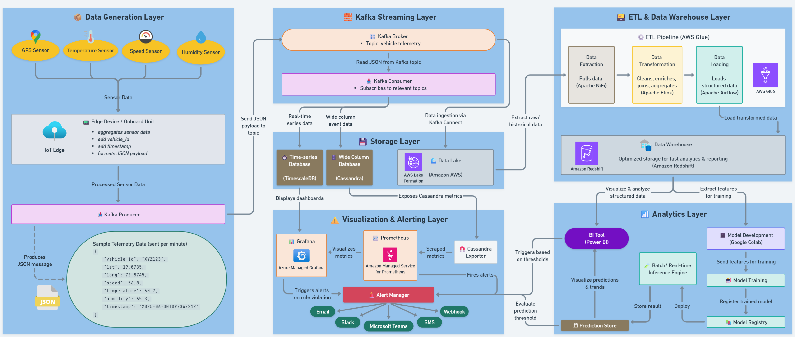

# Weekly report

## Week-1
### Objectives completed
- Set up kafka producer and consumer for vehicle data.
- Created a separate branch timescaleDB-integration to integrate **TimescaleDB** with consumer.
- Integrated **TimescaleDB** to store consumer-processed data.
- Containerized services using **Docker** and managed environments with **Anaconda**.
- Launched **4 producer containers**, each simulating data for one vehicle, to test multi-vehicle data flow.
  
---

### Implementation Summary
- **Producer**: Generates vehicle data: vehicle id, latitude, longitude, speed, temperature, humidity, timestamp.
- **Consumer**: Listens to the topic and inserts data into a TimescaleDB table.
- **TimescaleDB**: Used for time-series data storage.
- **Docker**: Orchestrates kafka, TimescaleDB and application services.
- **Anaconda**: Used for managing python dependencies locally.
- **Branching Strategy**:
  - Initial kafka producer-consumer code was developed on `main` branch.
  - Created `timescaleDB-integration` branch to isolate and implement TimescaleDB integration.
  - Producer and consumer code were modified accordingly in the 'timescaleDB-integration' branch.

---
### Issues faced and Workarounds
#### 1. Docker on Windows
- **Problem**: Docker failed to start on reboot.
- **Workaround**: Switched to **dual-boot with linux** where docker runs reliably.

#### 2. TimescaleDB Slow Startup
- **Problem**: Consumer failed on startup due to database not being ready to accept connection.
- **Workaround**: Added **health check** and set **restart** to `always` in the consumer service configuration. This results in repeated connection attempts until TimescaleDB is ready. **Initial error logs still appear** but do not affect functionality.

#### 3. Resource Cleanup in Docker
- **Problem**: Try-finally and signal handling for graceful shutdown don't execute as expected inside Docker.
- **Status**: Still unresolved. Docker likely terminates processes too quickly for cleanup logic to run. Need deeper investigation.

---

### Closing Notes
This week focused on setting up the core kafka producer-consumer pipeline, integrating TimescaleDB for persistent storage and handling orchestration via Docker. Initial issues aroud Docker behaviour and container dependencies were identified and partially addressed. Further refinements will continue in the upcoming weeks.


## Week-2
### Objectives completed
- Integrated and dockerized **Grafana** with TimescaleDB to visualize vehicle telemetry data and included it in overall orchestration framework.
- Set up **Grafana dashboards** to monitor real-time data ingested via kafka consumer.
- Created a **Grafana contact point using webhook** to send alerts based on specific data threshold.

---

### Implementation Summary
#### Grafana Integration:
- Added Grafana as a Docker service.
- Configured TimescaleDB as a Grafana data source.
- Built dashboards showing various vehicle metrics over time.

#### Alerting Setup:
- Configured alert rules on vehicle metrics.
- Created a **webhook contact point** to send alert data to a local endpoint.

#### Docker Compose File Update
- Extended Docker Compose to include Grafana and handle environment variables and volumes.
- Ensured proper service dependencies (Grafana waits for TimescaleDB).

- **Branching Strategy**:
  - Integrated Grafana within `timescaleDB-integration` branch.
  - After completing all integrations and testing, merged `timescaleDB-integration` back into `main` branch to consolidate changes.

---
### Issues faced and Workarounds
The integration and setup went smoothly without any major issues. Minor challenges were resolved promptly as part of regular testing.

---

### Closing Notes
This week focused on **data visualization and alerting**, enhancing observability of kafka pipeline. The system is now more robust in terms of monitoing and operational visibility. Further refinements will continue in the upcoming weeks.


## Week-3
### Objectives completed
- **Replaced TimescaleDB with Apache Cassandra** as the primary data store for vehicle telemetry data.
- Updated **kafka consumer service to write data into Cassandra** instead of timescaleDB
- Began implementing **data export** functionality for analytics and reporting use cases.
- Studied **Data Lake and Data Warehouse** concepts to better understand long-term data architecture design.

---

### Implementation Summary
#### Cassandra Integration:
- Replaced TimescaleDB with **Apache Cassandra**.
- Refactored database schema and created a new table with
    - **Partition Key**: `vehicle_id`
    - **Clustering Key**: `timestamp` (ordered DESC)
- Replaced init.sql used with TimescaleDB by `init.cql` script
- Introduced a dedicated **cassandra-init service** to:
    - Wait for Cassandra readiness.
    - Check that the target keyspace and table exist before consumer begins writing.

#### Kafka Consumer Update:
- Refactored the consumer logic to support Cassandra integration using the updated schema.
- Ensured full alignment with init.cql definitions, including keyspace and table structure.
- Conducted integration testing with multiple producer containers to validate ingestion across multiple vehicle streams.

#### Branching Strategy:
- Created a new feature branch: **cassandra-migration** to preserve the fully working TimescaleDB implementation on main.
- Made all necessary changes for Cassandra integration within this new branch, ensuring TimescaleDB remains unaffected.

#### Additional Learning & Future Considerations
- Studied the concepts and differences between Data Lakes and Data Warehouses.
- Exploring how these architectures could be integrated to support scalable data storage and advanced analytics.
- Insights gained will inform future decisions on designing robust, long-term data storage and processing solutions.

---

### Issues faced and Workarounds
#### 1. Data Export Failing via Cassandra Exporter
- **Problem:** Attempted to enable metrics/data export using **bitnami/cassandra_exporter** and **criteord/cassandra_exporter**. The exporter frequently fails to start, either:
    - Hangs indefinitely, or
    - Crashes with an error: `Scraper stopped due to uncaught exception: Failed to retrieve RMIServer stub...`
- **Status:** Unresolved. Issue appears related to JMX or RMI misconfiguration within the containerized Cassandra environment. Investigating exporter configurations and possible use of alternative metric exporters or custom scrapers.

#### 2. Cassandra Container Memory Limits
- **Problem:** The Cassandra container was repeatedly crashing due to insufficient memory allocation, especially during initial data ingestion.
- **Workaround:** Increased memory allocation in Docker settings and adjusted Cassandra’s JVM_OPTS to reduce heap usage. System stability has improved post-configuration.

---

### Closing Notes
This week centered on migrating from TimescaleDB to Apache Cassandra, updating the Kafka consumer logic, and laying the groundwork for data export and monitoring. The primary challenge encountered is unstable export functionality due to issues with the Cassandra exporter, which currently hinders reliable data scraping and monitoring.

Despite these challenges, the migration is progressing steadily. Once these export issues are resolved, we plan to integrate Prometheus for metrics collection and Grafana for visualization to fully restore and enhance monitoring capabilities.

## Week-4
### Objectives Completed
- Conducted a comprehensive study on modern data storage architectures: **Data Lakes, Data Warehouses, and Data Lakehouses**.
- Prepared a detailed **presentation (PPT)** covering architecture, tools, benefits and challenges including a comparative analysis.
- Explored **ETL vs ELT paradigms** and their role in data pipeline strategies.
- Built foundational knowledge to inform future integration of scalable long-term storage and analytical layers into the Kafka-based data pipeline.

---

### Key Learnings & Presentation Highlights
#### Core Topics Covered in the Presentation:
  - **Overview of Data Lake**
    - **Centralized** repository to store **structured, semi-structured, and unstructured data in native format**.
    - **Top 7 Data Lake Tools:**
        1. Amazon S3 & AWS Lake Formation
        2. Databricks Lakehouse (Delta Lake)
        3. Microsoft Azure Data Lake Storage (ADLS)
        4. Google Cloud Storage & BigLake
        5. Snowflake Data Cloud
        6. Apache Iceberg
        7. Dremio Lakehouse Platform
    - Outlined the **Data Lake Architecture** including
        1. Data Sources
        2. Data Ingestion
        3. Data Storage & Processing
        4. Analytical Sandboxes
        5. Data Consumption
        6. Governance, Security and Monitoring
    - **SWOT Analysis** to show Strength, Weakness, Opportunity and Threats of using Data Lake.
  - **Overview of Data Warehouse**
    - Optimized for storing and querying **structured, cleansed, and transformed data**.
    - **Top 7 Data Warehouse Tools:**
        1. Snowflake
        2. Azure Synapse Analytics
        3. Google BigQuery
        4. Amazon Redshift
        5. IBM Db2 Warehouse
        6. Oracle Autonomous Data Warehouse
        7. Firebolt Cloud Data Warehouse
    - Covered **architectural tiers** (single, two-tier, three-tier).
    - Discussed **Data Marts (dependent, independent, hybrid)** for departmental analytics.
    - Explained **Challenges and Benefits of using Data Warehouse**.
  - **Compared traditional ETL pipelines with modern ELT workflows**, highlighting trade-offs in speed, cost, and privacy.
  - Introduced the **Lakehouse paradigm** — combining the best of both Data Lakes (flexibility) and Data Warehouses (reliability). Described benefits like **unified storage, reduced data duplication and compatibility with real-time analytics**.

#### Relevance to Ongoing Project:
- Insights from the presentation directly support **architectural decisions for the Kafka pipeline project**.
- Will help determine the **end-to-end architecture** for monitoring the vehicles.

#### Project Status:
This week’s focus was research and understanding. No new feature branches created; output was knowledge consolidation. The findings will influence implementation choices in upcoming weeks.

---

### Challenges Faced and How They Were Addressed
#### 1. Grasping Clear Conceptual Differences Between Architectures
- **Challenge:** Initially, it was difficult to clearly differentiate between Data Lakes, Data Warehouses, and Lakehouses — especially in terms of architecture, purpose, and use cases. Many overlapping definitions and tool-specific implementations made it confusing.
- **Approach Taken:** Addressed this by consulting multiple **high-quality resources, whitepapers, and technical blogs**. Focused on breaking down each architecture layer-by-layer, which helped develop a deep, contextual understanding.

#### 2. Consolidating Extensive Information into a Concise and Coherent Presentation
- **Challenge:** Gathering data from various sources and distilling it into a single, well-structured file was challenging. It was easy to get overwhelmed by the breadth and detail available.
- **Approach Taken:** Tackled this by **prioritizing foundational concepts** first, then layering advanced ideas on top. Grouped topics logically and focused the content on clarity, relevance, and flow for the intended audience.

---

### Closing Notes
This week was centered on **deep research and understanding**, resulting in a well-structured presentation covering modern data architectures. Significant progress was made in understanding the evolving ecosystem around Data Lakes and Warehouses, and documenting these insights for future use.

Next steps will involve **designing an architectural diagram for the full end-to-end pipeline**. This **visual blueprint** will help align the technical implementation with business goals and provide a clearer overview of the real-world scenario.

## Week-5
### Objectives Completed
- Designed a complete end-to-end **architecture diagram** for the Kafka-based vehicle telemetry pipeline.
- Developed an **initial version** using **AWS and Azure** managed services for ETL, storage, data lake, and visualization.
- Incorporated **feedback from mentor**, identifying cost and complexity issues with the initial design.
- Based on this, created a **revised architecture** using only **open-source and self-hosted tools**.
- All services were **containerized using Docker** for consistent deployment.

---

### Architecture Layer Flow Overview

```
Data Generation Layer → Kafka Streaming Layer → Storage Layer → Visualization & Alerting Layer → ETL and Data Warehouse Layer → Analytics Layer
```

---

### Initial Architecture Overview (Cloud-Dependent Version)

#### **1. Data Generation Layer**
- Simulated vehicle telemetry data includes:
  - `location`, `temperature`, `speed`, `humidity`
- Data flows from **sensors → edge devices**.
- Edge devices enrich the data with `timestamp` and `vehicle_id`.
- Data is sent to the **Kafka Producer**.
- Example JSON payload:
  ```json
  {
    "vehicle_id": "VH001",
    "timestamp": "2025-07-06T12:00:00Z",
    "latitude": 37.7749,
    "longitude": -122.4194,
    "speed": 65,
    "temperature": 28.5,
    "humidity": 60
  }
  ```

#### **2. Kafka Streaming Layer**
- **Kafka Broker** receives JSON payload from Kafka Producer and stores it in the appropriate **topic**.
- **Kafka Consumer** subscribes to the topic and consumes data for downstream processing.

#### **3. Storage Layer**
- **TimescaleDB** stores **structured time-series data** (optimized for queries over time).
- **Apache Cassandra** stores **wide-column event data**, scalable for high-ingestion rates.
- **AWS Lake Formation** serves as the **Data Lake** which is built on top of **Amazon S3**:
  - Ingests raw and semi-structured data (via Kafka Connect or batch loaders).
  - Provides metadata management, fine-grained access control, and data cataloging.

#### **4. Visualization & Alerting Layer**
- **Cassandra Exporter** exposes internal Cassandra metrics via HTTP endpoints.
- **Amazon Managed Prometheus** scrapes those metrics periodically.
- **Azure Managed Grafana** is used to:
  - Visualize data from **TimescaleDB** and **Prometheus**.
  - Create real-time operational dashboards.
- **Alertmanager** used for rule-based alerting.
  - Notifications are sent via:
    - Email  
    - Slack  
    - Microsoft Teams  
    - SMS  
    - Webhooks

#### **5. ETL and Data Warehouse Layer**
- **AWS Glue** handles core ETL operations (transformations, data cleaning, and loading).
- Tool-specific assignments:
  - **Apache NiFi** – handles **data extraction** from various sources.
  - **Apache Flink** – designed for **stream transformations and loading**.
  - **Apache Airflow** – used to **orchestrate ETL pipelines** and scheduling.
- **Amazon Redshift** serves as the **Data Warehouse** for:
  - Structured analytics
  - OLAP queries
  - Departmental reporting

#### **6. Analytics & Machine Learning Layer**
- Data is extracted from the Data Warehouse for **feature engineering and model development**.
- Model development done in **Google Colab**.
- Trained models are registered and deployed via **Batch or Real-time Inference Engine**.
- Inference outputs stored in a **Prediction Store**.
- **Power BI** used for:
  - Visualizing predictions
  - Business-level reporting
  - Feeding decision signals back into **Alertmanager** when needed

---

### Known Issues with the Initial Architecture (Based on Mentor Feedback)
- **Use of Costly Cloud Services:** Reliance on AWS (S3, Redshift, Glue) and Azure (Grafana) made the architecture expensive and less suitable for long-term or academic use.
- **Mixed Cloud Providers:** Combining AWS and Azure increased architectural complexity, integration effort, and operational overhead.
- **Vendor Lock-In:** Use of managed services tightly coupled the architecture to specific cloud platforms, limiting portability and flexibility.

---

### Redesigned Architecture Overview (Open Source & Self-Hosted)

- Kafka Producers sent data to Kafka Brokers, coordinated by **Zookeeper** and Kafka Consumers processed data and passed it to downstream systems.
- **MinIO** served as an S3-compatible **self-hosted Data Lake**.
- **Apache NiFi** replaced AWS Glue for ETL workflows.
- **Apache Druid** replaced Redshift, serving as a real-time analytics warehouse.
- **Metabase** replaced Power BI for business intelligence and dashboarding.
- Every component (**Kafka Producer**, **Kafka Broker**, **Zookeeper**, **Kafka Consumer**, **TimescaleDB**, **Cassandra**, **Cassandra Exporter**, **Grafana**, **Prometheus**, and **Alertmanager**) was **Dockerized**, supporting consistent deployment and development environments without cloud dependencies.

---

### Challenges Faced and Solutions
#### 1. Visualizing Complex Systems
- **Challenge:** Maintaining readability of the architecture diagram given multiple layers and tools.
- **Solution:** Structured the layout into logical layers, with minimal cross-layer overlaps and consistent labeling.

#### 2. Tool Replacement and Compatibility
- **Challenge:** Mapping cloud-native services to reliable open-source equivalents.
- **Solution:** Selected tools like NiFi, MinIO, and Druid based on community support, feature set, and suitability for local deployment.

---

### Closing Notes

This week was focused entirely on designing a robust, scalable architecture for the vehicle data pipeline. The initial version helped define all functional blocks, but mentor feedback highlighted concerns around cloud cost and complexity. In response, a second, open-source-based version was built to be vendor-neutral and deployment-friendly.

Additionally, a preliminary exploration of **Apache Flink** was started this week to assess its relevance for real-time stream processing. Its integration will be considered in future weeks based on feasibility and use cases.

## **Week-6**

### **Objectives Completed**

* Successfully integrated **Apache Flink** into the pipeline to consume real-time Kafka telemetry data and write it to **TimescaleDB**.
* Fixed **JMX configuration** issues to enable **Prometheus-based metric scraping from Cassandra**.
* Updated the **overall architecture** to reflect Flink as the new stream processing engine between Kafka and TimescaleDB.

---

#### **Architecture Update**

* The new pipeline now flows:

  ```
  Kafka Producer → Kafka Broker → Apache Flink → TimescaleDB
  ```

---
### **Implementation Summary**

#### **Apache Flink Integration**

* Implemented a **Flink job** (via `flink.py`) to read telemetry data from **Kafka** and write records into **TimescaleDB**.
* Set up a **custom Dockerfile** to install **PyFlink**, required **JARs**, and system-level packages.
* Ensure Flink jobs can be submitted and executed from within the container.
* Configured Flink **job manager** and **task manager** as services in `docker-compose.yml`.

#### **JMX Integration for Cassandra**

* Enabled **JMX ports** and configured **`jmx_prometheus_javaagent`** in the Cassandra container.
* Prometheus is now able to **scrape JVM metrics** such as memory usage, GC stats, and thread count from Cassandra.

---

### **Issues Faced and Workarounds**

#### 1. Flink Job Not Processing Data

* **Problem:** Flink connected to Kafka, but no data was processed initially.
* **Solution:** Resolved by correcting topic names, setting Kafka consumer group ID, and adjusting data types.

#### 2. Missing Dependencies in Flink Container

* **Problem:** Required Python and Java dependencies were missing in the default Flink container.
* **Solution:** Built a custom **Flink Docker image** including:

  * **PyFlink**
  * Necessary **Flink and JDBC JARs**
  * Required Python libraries for PostgreSQL connection and JSON parsing.

#### 3. Flink Job Execution from Python

* **Problem:** `flink run` was not executing the job properly from within the container.
* **Solution:** Used command in `docker-compose.yml` to ensure that `flink.py` gets submitted automatically after Flink components start.

#### 4. Cassandra Metrics Still Not Exposed Initially

* **Problem:** Even after adding `jmx_prometheus_javaagent`, metrics were not visible in Prometheus.
* **Solution:** Verified JMX port exposure, added the proper `jmx_exporter.yml`, and confirmed Prometheus target endpoint. Updated Dockerfile to copy agent JAR correctly.

---

### **Closing Notes**

This week marked a major technical milestone with the successful **implementation of Apache Flink as the stream processing layer** in the pipeline. Despite initial hurdles with Flink job submission and Kafka connectivity, a stable, Dockerized setup was achieved. In parallel, **Cassandra’s observability was enhanced** by enabling JMX metrics export, allowing full integration with Prometheus and Grafana. The **updated architecture** now reflects a scalable, real-time data processing and storage pipeline with proper monitoring.

Overall, the project demonstrates a robust, production-aligned design, ready to be extended with real IoT devices, cloud deployment, and machine learning capabilities.
